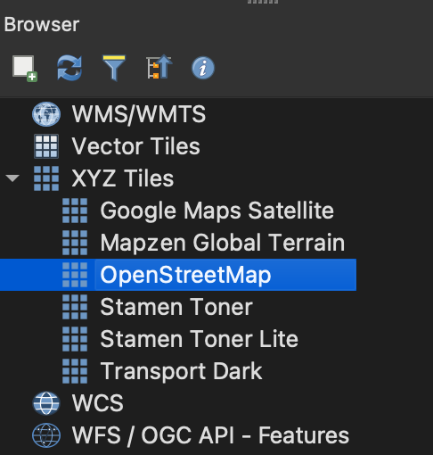
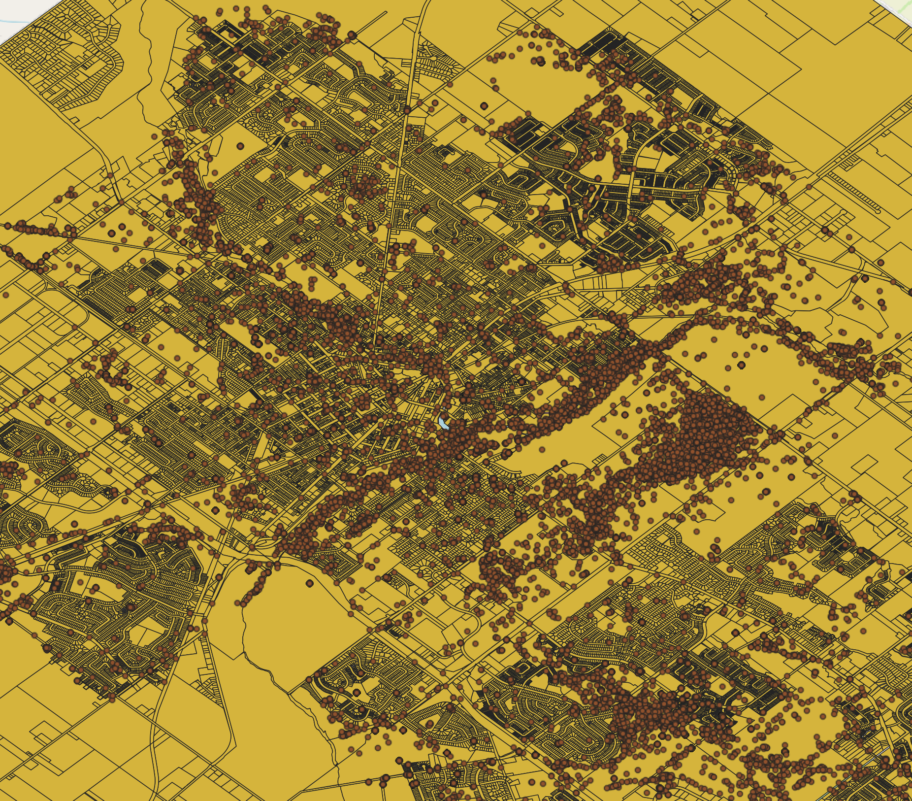
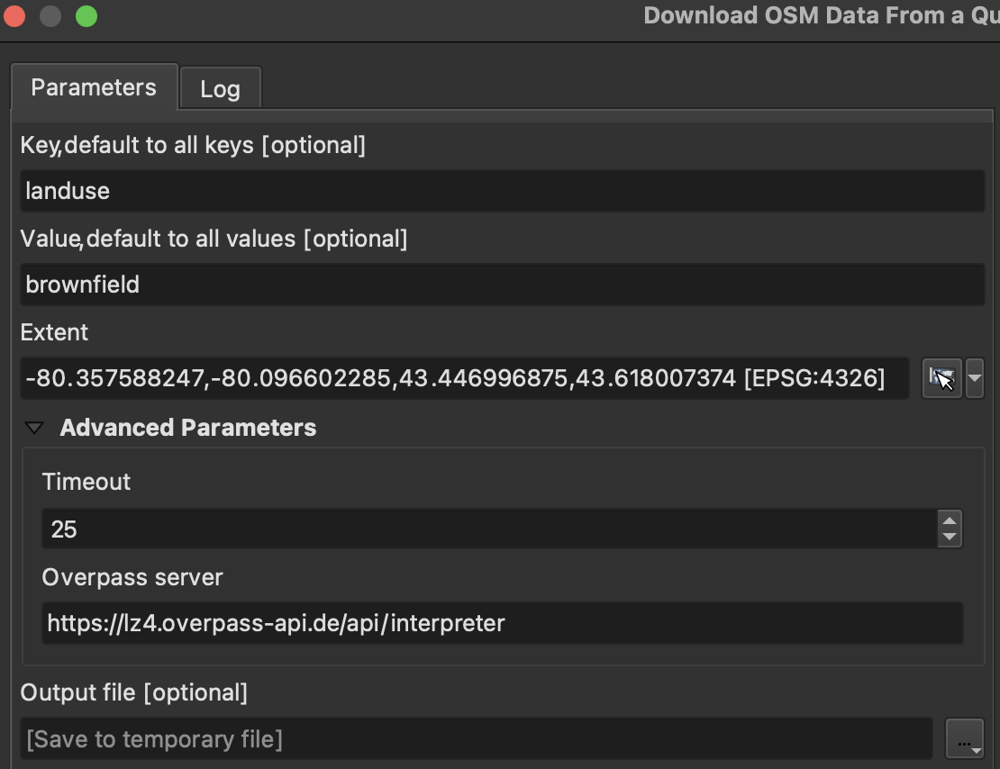
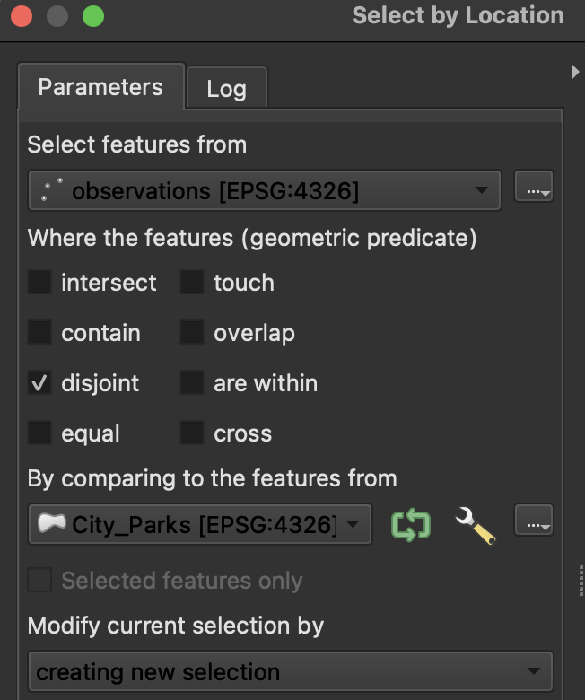
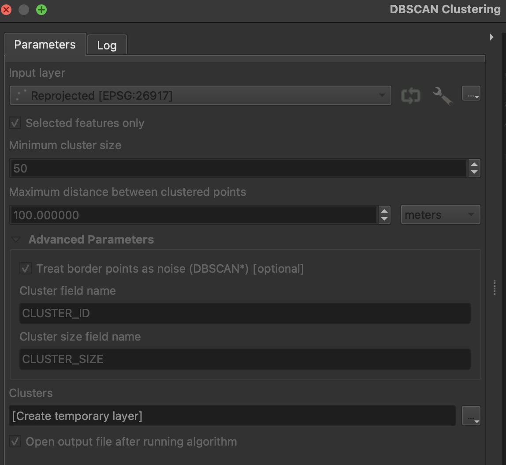
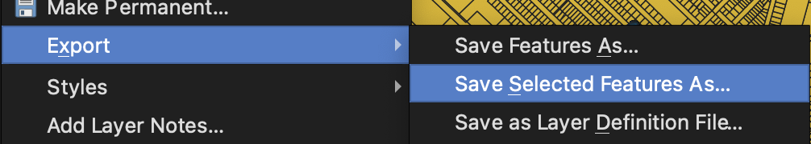
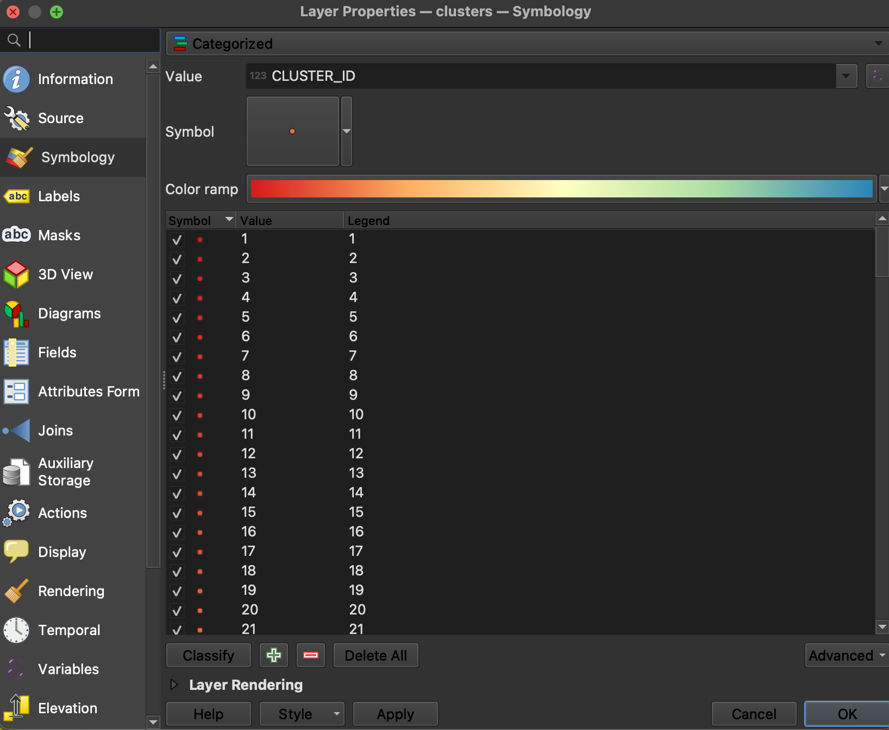

---

layout: default
title: Digital Conservation - Guelph's Informal Green Spaces Lab

---
Informal greenspaces (IGS) are outdoor places people use for recreational purposes, but which aren’t formally protected as parks. In the context of an urban area, this may include a variety of private and public land that is not designated as a city park, conservation authority land that isn’t meant for recreational uses, and so on.

Determining where informal greenspaces are may help to identify places that need to be protected since these are often at risk to development in ways that certain areas – e.g. Greenbelt zones areas – aren’t (not to say Greenbelt areas are well-protected!) In a world where the COVID pandemic has made us realize the benefits of nature recreation for well-being, we should realize that this is possible not just through urban national/provincial parks and large-scale conservation, but pocket parks and even those areas that are not on the map.

But how do we find out where these places are? By definition, IGS are about use and not use by birds or animals, but by people. So we need people data. Volunteered geographic information (VGI) is exactly that. This is sometimes known as “crowdsourced” data and it comes from a variety of general and specific purpose social media sources. For instance, Open Street Map is an open source equivalent to Google Maps, in which volunteers contribute the map data. They add a variety of information, like the location of restaurants or even backyard swimming pools (drawn from satellite imagery). In our case, there may be locally-contributed trails or informal parks that we can glean from Open Street Map that may not be visible on Google. Other sources may be more specifically-tailored to nature and/or recreation. For instance, Strava is an app that enables users to record their geographic location as they walk, hike, run, bike, or otherwise exercise. eBird and iNaturalist are popular nature observation apps where users can record the geographic locations of birds, animals, and plants they come across.

This lab will help us to get to know two key conservation technologies – GIS and VGI  – through the context of an underexplored conservation issue: informally used spaces. Credit to Zo Ross for developing the idea and to the SSHRC Insight Development program for support. 

### Requirements
To complete this lab, you will need the following:
* Access to [QGIS](https://www.qgis.org/en/site/forusers/download.html) - free, open access mapping software
* Access to the datasets (linked to in the Instructions below)

### Learning Objectives
1.  become familiar with VGI
2.  become familiar with GIS
3.  become familiar with IGS
4.  consider some of the practical and ethical considerations in GIS and VGI

## Instructions
1. Start QGIS, a free and open access desktop mapping tool
2. Download the file representing [observations](assets/other/observations.zip) from eBird and iNaturalist, as well as data from the City of Guelph - formal [park boundaries](assets/other/City_Parks.zip) and [property lines](assets/other/Property_Lines.zip). Your own city probably has a similar GIS hub if you want to explore that instead.
* The City of Guelph property lines data come from [here](https://geodatahub-cityofguelph.opendata.arcgis.com/datasets/cityofguelph::property-lines/explore?location=43.532318%2C-80.226850%2C12.97). Property lines will help us map out IGS on a property parcel basis. If we can identify the public and private properties that IGS are on, we can then advocate for them through landowner outreach or otherwise.
* The City of Guelph park boundaries are from [here](https://geodatahub-cityofguelph.opendata.arcgis.com/datasets/cityofguelph::city-parks/explore?location=43.538239%2C-80.241150%2C13.81).
* eBird observations are from [here](https://www.gbif.org/occurrence/download/0208115-230224095556074). They represent observations made in the city limits 2020-2023.
* iNaturalist observations are from [here](https://www.gbif.org/occurrence/download/0208125-230224095556074). They represent research-grade observation in the city limits 2020-2023.
3. Unzip these data files.
4. Return to QGIS. Let’s get familiar with it. First, add a basemap. To do this, find the “Browser” panel.  You may have to go to View -> Panels -> Browser to open it. Look for XYZ Tiles. XYZ tiles are “basemaps” that are like what you see on Google Maps. Indeed, you can add Google Maps to QGIS! But let’s stick with OpenStreetMap. Drag that XYZ tile onto the blank space in the middle of the software. You should see the outline of the world appear. Zoom into Guelph by using the Zoom button or by scrolling the mouse. You’ll also notice that the OpenStreetMap XYZ tile layer has been added to the list of Layers. \
{: width="75%" height="75%" }
5. Add the unzipped data files. Drag each .shp file from your folder to the map pane “onto” the basemap. You can move layers up and down in the “drawing order” so that, for instance, the “polygon” layers – the parks and the property boundaries are at the bottom, and the “points” – the eBird and iNaturalist observations, are at the top. You should see something like this on the map: \
{: width="75%" height="75%" } \
(Default colours may vary, and they don't really matter at this point)
6. Once you have each layer of the data on the map, you may wish to resymbolize them in order to make things clearer. You can resymbolize each layer by right clicking on it in the Layers menu, selecting Properties, and then choosing Symbology. Your main options are color and opacity. For instance, you could make the parks and property boundaries less opaque in order to see the underlying basemap. 
7. Now that we have some context – where people might be recreating (via eBird and iNaturalist), and where existing formal parks are - we are going to use the QuickOSM plugin to help us further narrow our search for IGS. Install the QuickOSM plugin by selecting Plugins from the top menu, then "Manage and Install Plugins", and searching for QuickOSM. Make sure the plugin is "on" by selecting the checkbox to the left of it. Plugins are extra bits of software that users have written to help each other do more specialized tasks with software tools. In this case, QGIS plugins help us do different kinds of analyses. QuickOSM in particular allows us to retrieve the Open Street Map (OSM) data in the basemap itself. This will help us interact with additional features of the landscape, such as areas determined to be residential, industrial, and/or commercial that we do not expect to be IGS.
8. Open QuickOSM by selecting Processing from the top menu and then "Toolbox." Choose "Download OSM data from query in an extent." In the menu, type `landuse` in the "Key" bar and `brownfield` in the "Value" bar. Use the dropdown menu on "Extent" to select "Calculate from layer" and then "Property Lines"
* The menu should be filled in like this: \
{: width="75%" height="75%" }
* You should see a few new "polygons" added to the map after clicking Run. These represent brownfields within the boundaries of Guelph, or at least what the contributors to OSM have labeled as brownfields. Because OSM is a user-generated dataset, like Wikipedia is, there may be omissions (brownfields not labeled as such) or errors (places labeled as brownfields that aren't actually).
* Repeat the process above but instead of `brownfield` write `greenfield` and click Run. Greenfields are naturally vegetated areas that aren't officially parks and that aren't also former industrial sites, as brownfields are.
* The above two searches will help us with context. It’s likely though not strictly necessary that IGS will be found in brown or greenfields. 
* Investigate what other "[Map Features](https://wiki.openstreetmap.org/wiki/Map_features)" OSM contributors have categorized and catalogued and then see if there are any other elements you might want to add.
9. We are going to define IGS based on a mix of existing landcover types (brownfield, greenfield, etc.) as well as *use* (nature observations). We will start through a process of elimination, getting rid of properties based on whether we think they could be IGS. First, we'll remove properties that are in parks or near buildings. We will then manually eliminate some areas not captured from the above process. 
* Project the data to the same coordinate system in order to ensure the calculations that come in the following steps are done correctly. In the lower-right hand corner of the QGIS window click where it says “EPSG:XXXX”. Search for 26917, which is the code for the UTM Z17 N projection - this one fits the Guelph area well. (If you select this projection, click ok, and get some pop-up menus asking you to select a transformation, you can simply select the default and hit ok.)
* This will re-project our map "on the fly" so that the data appear to be in the correct place, but we also need to re-project the data itself - the coordinates - before we begin our analysis. To do this, search for "Reproject layer". Choose the observations layer as the input. Your "Target CRS" is the EPSG:26917 projection that you just set for the map itself. Click run. The output is a new layer called "Reprojected". These points are the same observations from iNaturalist and eBird, and they will show up in the same spots on the map, but it will be easier to do analysis with them. For the remainder of the lab, you will work from this "Reprojected" layer, not the original observations layer.
* There's just one more data processing step. Create a spatial index on the observations to make our analysis faster. To do this, search the Processing Toolbox for "Create spatial index" and run it for the "Reprojected" observations layer that was the ouput from the previous step.
* Now we can exclude observations made in city parks. Remember that in our search for IGS, we are avoiding "formal" greenspaces like parks, so it makes sense to narrow our search by filtering out iNaturalist and eBird species observations made within such areas. Search the Processing Toolbox for "Select by location." Select features from the reprojected observations that are “disjoint” (outside of) the city park features. The analyis should be set up like so: \
{: width="75%" height="75%" }
10. At this point, we have a bunch of observations "selected" or highlighted on the map. These give us a clue as to where IGS might be because they are outside of formal parks but they represent spaces where people are nonetheless interacting with nature. However, the data are quite "noisy."" There are observations all over the city, but sometimes only one or two here and there. We want to know where there are *clusters* of observations. We know there's a lot of data missing here in the sense that eBird and iNaturalist species observations are only proxies for the full scope of nature recreation. So by searching for clusters, we hone in on patterns and trends that may be as representative as possible.
* To do this, we will use something called DBSCAN clustering. Search for this tool in the Processing Toolbox.
* Using the "Reprojected" layer, check “Selected features only” to make sure you’re analyzing only the non—park observations we just highlighted.
* Set the minimum cluster size to 50 and the maximum distance between them to 100m. We want relatively close together areas of at least 50 related points. We can also treat border points as noise since we don’t know what’s on the other side of the border. At this point, you might be wondering - how do we know how to use this tool and make these specific decisions? Well, reasonable assumptions plus lots of trial and error...The menu should look like this: \
{: width="75%" height="75%" }
* Running the tool may take some time
* Once it's done, you'll notice that the new "Clusters" layer includes fewer observation points than we had originally. But there are still many observations on the map. That's because QGIS keeps all observations in the layer, even the ones that didn't end up as part of a cluster. Remove these unclustered points from the dataset altogether by using the "Select Features by Value" and the query "CLUSTER_ID" > 0. You will see that now even fewer observations are highlighted. Export these to their own layer by right-clicking on the Clusters layer, then choose "Save selected features as..." Give the file an appropriate name and be sure to choose the "ESRI shapefile" format, as well as "Add saved data to the map" (at the bottom of the window). \
{: width="75%" height="75%" }
* In order to actually see the clusters the DBSCAN technique defined, we have to change the symbolization. In the symbology menu for the filtered clusters layer, choose "Categorized" with "CLUSTER_ID" as the Value, select a colour scheme (spectral makes sense here), and then "Classify." and uncheck the “All other values” since these points/observations weren’t clustered. \
{: width="75%" height="75%" }
11. Now we want to identify the specific property parcesl these clusters are within so we can move forward with contacting the owners and otherwise treating these spaces as important for conservation / recreation.
* Create a spatial index on the clusters layer you've been working with in order to make analysis faster. Search Processing Toolbox for "Create spatial index" and run it.
* Now, open the "Select by location" tool again. Select features from "Property_Lines" where they *intersect* the clusters layer.
* There are quite a number of properties selected. However, not all of them are relevant. For instance, there are "laneways" in our selection. Remove them from the selected properties by first clicking the "Property_Lines" layer in the legend and then opening the "Select features by value" tool again. At the Parcel Type field write ROAD PARCEL. Use the dropdown menu next to the Select Features button to choose “Remove from Current Selection”. Do the same for LANEWAY parcels. 
12. At this point, we now have a decent map of properties where clusters of eBird and iNaturalist species observations are in the city of Guelph. You may wish to export these selected properties to their own layer using the same technique as above when we exported the clusters (righ-click on the Property_Lines layer, go to Export, and then choose "Save selected features as..." But we could bring our analysis full circle by comparing these properties with the "brownfield" and "greenfield" areas we examined earlier. Are our clusters of species observations on brownfield or greenfield properties?
* To answer this question, we will simply run one more "Select by location". Open the tool and choose "Property_Lines" for "Select features from." Intersect is the "geometric predicate", which simply means that we want to select properties that at least partially intersect with brownfields or greenfields. For "By comparing to the features from" choose the Brownfields layer first (later you can re-run this for the Greenfields layer). You should see that there are two properties selected.  \
{: width="75%" height="75%" }

## Reflections
* In your own words, what have we found? You may not know much about Guelph, but you still might be able to pick up on some of the limitations of our results (e.g. we have selected a lot of large property parcels even though often observations only occur on very small parts of those properties.)
* Is this data biased? If so, how? And what impact would that have on the analysis? Consider the fact that only some kinds of people are likely to post species observations to the eBird and iNaturalist apps, making their datasets skewed to some neighbourhoods and not others. Or how other (similarly skewed) datasets on nature recreation might be relevant in their own way, such as exercise activities from Strava. 
* How would eBird and iNaturalist data sources be useful in your own work as a conservationist?
* Is this data sensitive? Are there privacy concerns we should be aware of?
* What next steps? How would you want to analyze this data further?
* How easy was this? What capacity, cost, etc. would be needed to do a more rigorous analysis?
