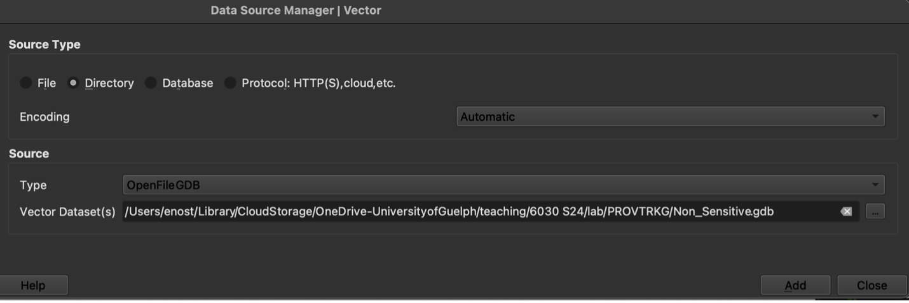
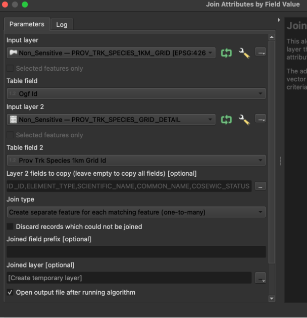
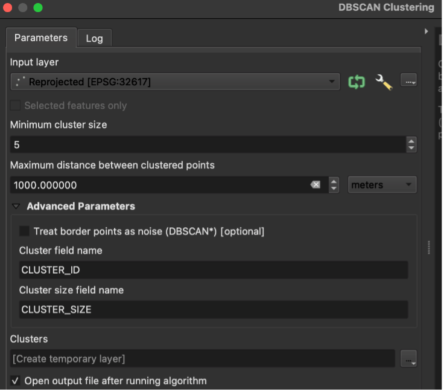
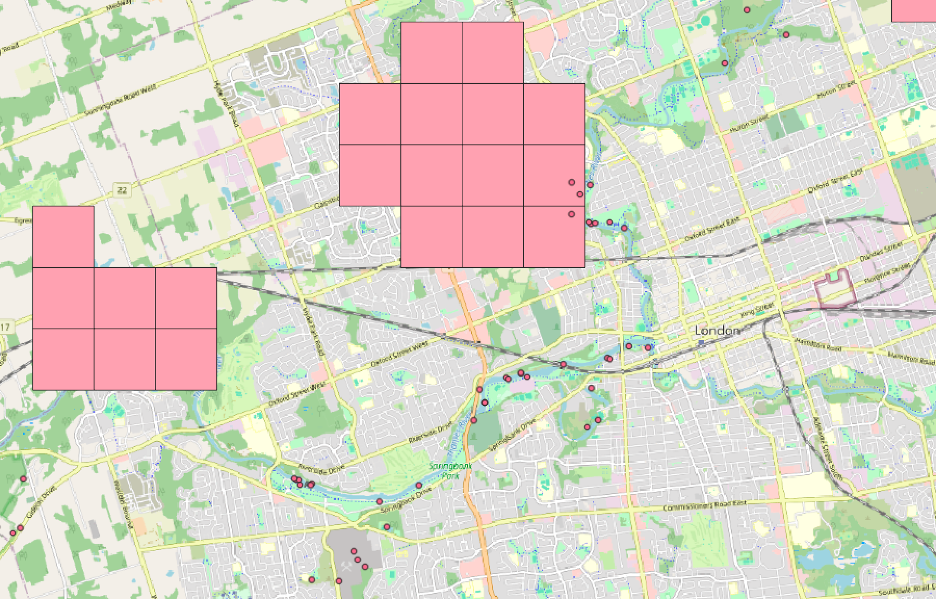
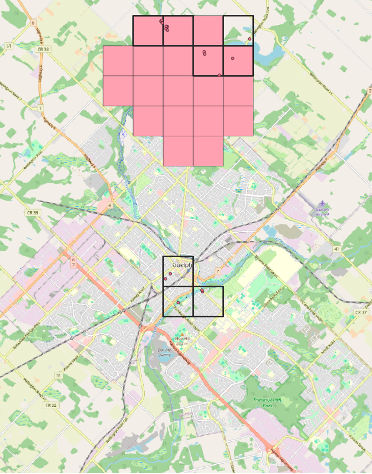

---

layout: default
title: Digital Conservation - Using iNaturalist to Supplement Natural Heritage Information
---
In this tutorial, we’ll use the open-source mapping software QGIS to visualize citizen science data from the iNaturalist platform and highlight unrecognized areas where species of conservation concern might exist.

In the province of Ontario, the [Natural Heritage Information Centre (NHIC)](https://www.ontario.ca/page/natural-heritage-information-centre) tracks what it calls “species of conservation concern,” including species at risk, in 1km-by-1km grid cells across the province. Each square kilometer cell is evaluated for whether a species is predicted to or has been recorded occurring there. The relatively coarse 1 sq. km. spatial resolution of the dataset is meant to protect sensitive species from disturbances such as poaching. [According to NHIC](https://data.ontario.ca/dataset/provincially-tracked-species-1km-grid), this dataset “can be used to identify species, ecological communities or natural heritage areas on or near your property or project site.”

But how does NHIC create this grid of species occurrence in the first place? NHIC is a member of the NatureServe network, which curates species location data from [a wide range of stakeholders](https://explorer.natureserve.org/AboutTheData/Sources/Distribution), including: “provincial, territorial, state and federal governments, citizen science platforms and digital biodiversity data resources (e.g., GBIF, iNaturalist), academia, non-governmental organizations, industry, species experts and Traditional Ecological Knowledge (TEK).” Although NatureServe and NHIC already incorporate “digital biodiversity data” including from citizen science sources such as iNaturalist, there may be opportunities to extend the use of these sources. For instance, there may be iNaturalist observations of species in areas not currently identified by NHIC’s grid.

We will compare the areas NHIC identifies a species occurring in with those where iNaturalist users have observed it. Although citizen science and social media data have their limitations, this comparison can give us a sense of whether these data can better account for species ranges, which might in turn influence land use decisions. We’ll look at bald eagles as our example, providing a proof-of-concept for what the analysis could look like for more sensitive and at-risk species (due to sensitive data restrictions, we are unable to do that specific analysis here; more detailed data with precise locations is available after obtaining a sensitive data use license from NHIC).

### Required software

QGIS is free and open-source mapping software. This tutorial was written for QGIS version 3.28, but may work on the latest long-term release, which is QGIS 3.34 as of the time of writing (May 2, 2024). The software can be downloaded for any operating system here: <https://qgis.org/en/site/forusers/download.html>

## Natural heritage information

1\. First, **let’s download natural heritage information from** [**this website**](https://www.ontario.ca/page/get-natural-heritage-information). Specifically, we want to download the “Species of conservation concern (including species at risk), plant communities, wildlife concentration areas and natural heritage areas at the 1km grid level” dataset. It can be found [here](https://geohub.lio.gov.on.ca/datasets/provincially-tracked-species-1km-grid). Click download and select “[Complete File Geodatabase](https://www.gisapplication.lrc.gov.on.ca/fmedatadownload/Packages/fgdb/PROVTRKG.zip)” at the bottom of the page.

This dataset contains both NHIC’s 1 sq. km. grid for the province as well as a table with records for each part of the grid where tracked species are estimated to occur in. For reference and metadata, please see [here](https://www.publicdocs.mnr.gov.on.ca/mirb/Provincially%20Tracked%20Species%201KM%20-%20Data%20Description.pdf).

2\. Next, **unzip the data** you just downloaded. On Macs, this will involve double clicking the file. On PCs, this involves right clicking and opening using a utility such as 7-Zip.

3\. **Open QGIS.** Create a new project by clicking the blank white page icon in the upper left portion of the screen. This will create a blank map for us.

4\. Now we will **add the dataset we just downloaded to the map**.

- Find the Layer menu at the top of the screen and then select Add Layer…Add Vector Layer.
- In the menu that appears, set the Source Type to Directory.
- From the Type dropdown menu, select OpenFileGDB.
- In the Vector Dataset(s) menu, click the button and navigate to the unzipped dataset, clicking through “PROVTRKG” to select Non_Sensitive.gdb.
- Click Add.
- You may be prompted to “Select Items to Add” – if so, make sure both items are highlighted and then click Add Layers. You might also be prompted to Select Transformation….If so, click OK.\
\
(note: your screen might look different; I have “dark mode” enabled)

What do we see here? We have two layers in our list on the left-hand side of the screen now: 1) the 1 sq. km. grid, which will also appear on the map as a series of rectangular boxes; 2) A table that contains information on species occurrences in each part of the grid.

5\. At this point, you might be wondering, why do the grid cells appear as rectangles rather than squares (since they are 1km by 1km in size)? This is because of how the mapping software is “projecting” the data’s spatial coordinates onto the map. **We just need to change the projection to one more appropriate for our analysis.**

- We can do this by clicking the icon in the lower right-hand corner of the window that says EPSG:4269.
- In the menu that appears, search for 32617, which is the code for WGS 84/UTM zone 17N, a projection that accurately displays spatial data for this part of the world. Select the projection and click Ok.
- You might be prompted again to Select Transformation…just click Ok again.

The rectangles should now be squares!

6\. But how do we know which of these square kilometers are home to bald eagles? **To find out, we need to first join the table to the spatial grid.** We will do so by matching key identifiers from the species occurrence table with their equivalents in the grid. Search for the “Join attributes by field value” tool in the Processing Toolbox, which can be found by clicking Processing at the top of the screen and then Processing Toolbox. Complete the menu as following:

- The Input layer should be the grid
- The table field should be Ogf Id (this is the column in the grid attributes that has an equivalent in the species occurrence table)
- Input layer 2 is the species occurrence table (“…DETAIL”)
- Table field 2 is Prov Trk Species 1km Grid Id, the column in this table that matches Ogf Id in the Input layer
- Layer 2 fields to copy can be left blank to copy all fields
- The joint type is “Create separate feature….one-to-many” because of the way the data are structured, where each grid cell can be home to more than one species\
{: width="75%" height="75%" }\
- Click Run. This may take a minute to complete. You can close the menu afterwards.

7\. Now we can **highlight locations of species using the “Joined layer”** that was produced in the previous step. We will “filter” the grid to show only those square kilometers where NHIC tells us bald eagles occur.

- Right-click on “Joined layer” and choose “Filter…”
- In the menu that appears, double click SCIENTIFIC_NAME to begin writing the expression for our filter. Then choose “=”. Finally, type 'Haliaeetus leucocephalus'
- Click Ok.

This will filter the map to only the cells where bald eagles are observed or expected to occur. As you can see, there aren’t that many in southern Ontario. Perhaps we can change that by using iNaturalist records to demonstrate a wider range for bald eagles….

> What counts as an occurrence? [According to NHIC](https://www.ontario.ca/page/natural-heritage-methodology), “The \[NatureServe\] specifications define what does and does not constitute an element occurrence. For example, for a bald eagle, the NHIC considers a record for a nesting site an element occurrence or part of an element occurrence. But it does not consider a record of a migrating bald eagle an element occurrence or part of an element occurrence.” 

## iNaturalist observations

8\. To potentially demonstrate a wider range for bald eagles, we will **load some records from iNaturalist**. An iNaturalist dataset containing all observations of bald eagles in Ontario over the past 20+ years is available from the Global Biodiversity Information Facility [here](https://www.gbif.org/occurrence/download/0010455-240425142415019).

- Download it and unzip it.
- Then, in QGIS, choose Vector -> Add Delimited Text.
- In the menu that appears, for the File name option, click the button and navigate to the unzipped file and select the CSV.
- Select custom delimiters and choose Tab, if it isn’t already selected.
- Make sure “First record has field names” is selected.
- In the Geometry Definition section, choose Point coordinates. X field and Y field should populate automatically to decimalLongitude and decimalLatitude, respectively.
- For Geometry CRS, select WGS 84 (EPSG 4326), if it is not already.
- Click Add and then Close.

Take a look at the map. Now we have the bald eagle sightings from iNaturalist as well as the bald eagle recorded areas from the provincial monitoring dataset. We can see some overlap but also some differences. There are bald eagles observed throughout the province – not just in the existing grid areas. There are also some areas where no bald eagle sightings have been recorded on iNaturalist, though this is perhaps an artefact of the opportunistic sampling that the platform is based on, where users are typically not making systematic, structured observations.

### Analysis

9\. What we want to do now is use the iNaturalist data to identify bald eagle “clusters” that are distinct from areas NHIC already identifies as bald eagle occurrence areas. **First, we’ll identify the clusters.** There are many single individual bald eagle observations on our map, but these could be one-off sightings rather than true habitat. So we will filter the iNaturalist observations to clusters – observations those that are near other observations.

To do this requires a few preliminary steps:

- We need to project the coordinates in this dataset so that we can accurately and quickly calculate distances between them. Earlier, we changed how the software interprets the coordinates in our datasets so that the grid cells would be projected as squares not rectangles; now we need to actually change the coordinates themselves. Use the Processing Toolbox menu to the find the Reproject layer tool. Select the iNaturalist observations as input and choose the Project CRS (UTM Z17N) as the Target CRS.
- We also need to create a spatial index to speed up the rest of the calculations we’ll make. Search the Processing Toolbox for Create Spatial Index. Choose the “Reprojected” layer that was the output of the previous step.
- With those steps out of the way, we can proceed with identifying “bald eagle clusters.” We will use something called DBSCAN clustering. Search for this tool in the Processing toolbox.
- Use “Reprojected” layer as the input
- Set the minimum cluster size to 5 and the maximum distance between them to 1000 meters. We want relatively close together areas of at least 5 observations. At this point, you might be wondering - how do we know how to make these specific decisions? Well, they are reasonable assumptions – 5 sightings of bald eagles less than 1 kilometer apart suggests repeated use of the area, and hence habitat, certainly compared to one off sightings in the middle of nowhere…In the end, your menu should look like this:
{: width="75%" height="75%" } \
Once it’s done, you’ll notice that there are still many observations on the map. That’s because after the DBSCAN QGIS will retain all observations in the layer, even the ones that didn’t end up as part of a cluster.

Remove these unclustered points from the dataset altogether:

- Use the Select Features by Value tool and the query “CLUSTER_ID” > 0 (to do this, you just need to enter 0 into the “CLUSTER_ID” form and then choose “> Greater Than” from the associated dropdown menu).
- You will see that now even fewer observations are highlighted. Export these to their own layer by right-clicking on the Clusters layer, then choose “Save selected features as…”
- Give the file an appropriate name and be sure to choose the “ESRI shapefile” format, as well as “Add saved data to the map” (at the bottom of the window).

10\. Finally, we want to **assess the extent to which the NHIC grid cells line up with these bald eagle clusters**. Visually, we can see some interesting differences. (Consider adding a basemap for context – to do this, select OpenStreetMap from the XYZ tiles section of the Browser panel). For instance, the area around London includes many observations along the Thames River even though the NHIC grids only sometimes intersect with the river.\
{: width="75%" height="75%" }\
For a more rigorous and less visual analysis, we will **select the grid cells that contain clusters of bald eagle sightings**. First, clear the filter on the grid (see step #7 above) so that we can see all the grid cells, not just the ones the province currently thinks has bald eagles.

- Right click on the “Joined layer”, then “Filter…” select Clear and then Ok.
- Next, to speed up the rest of our analysis, Create a Spatial Index on the Joined layer using the same tool as in step #9 above for the iNaturalist observations.
- Then, search the Processing Toolbox for the Select by Location tool.
- Select features from the grid (“Joined layer”) that intersect the iNaturalist observations.
- Export this selection of areas by right-clicking and choosing Export…Save Selected Features As…. Just as you did with the bald eagle clusters in #9 above.
- Add the NHIC grid cells with bald eagles (repeat #7 above). Symbolize them so you can compare with the clusters. You might end up with something like this, which shows us iNatrualist based-definition of bald eagle range, alongside the province’s NH-based definition.
{: width="75%" height="75%" }\
The pink areas are those identified by NHIC while the black outlined areas are those identified by us as bald eagle clusters. Where they overlap (pink areas with black outlines) there is agreement in the two approaches. Where we have just black outlines, we have potential new occurrence areas. Where we have just pink squares we have areas where perhaps bald eagles are expected to occur based on habitat features or have been observed by non citizen science sources.

### Reflections

- What are the limitations of our approach, including the datasets we’ve used?
- What kinds of assumptions did we have to make along the way, and when? How might different choices have affected our results?
- What sorts of ethical concerns can you identify in this analysis, perhaps around our use of VGI (volunteered geographic information) or in terms of sensitive species?
- Will this work for policy or in decision-making?