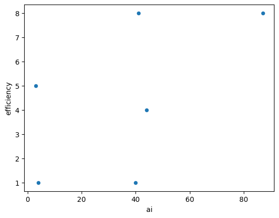

---

layout: default
title: Digital Conservation - observatory Tutorial

---
## Tutorial: observatory

This is a Python package for collecting and analyzing webpages. While there are many Python packages for individual components of a website-based content analysis, observatory is designed to provide a full set of tools for an entire project:
* handling credentials
* automated searching Google for relevant webpages (and, previously - before changes to the platform's data access policy - searching Twitter for relevant links posted in tweets)
* crawling websites from a list of topic domains
* scraping content from those sites and storing it in a database
* querying that database to return keyword counts
* visualizing these results

In what follows, we offer an example use of observatory. We will use the package to explore what top-ranked pages returned by a Google search for "nature conservation and artificial intelligence" have to say about the role of AI in habitat and species protection. Is this "conversation about conservation" optimistic about AI? Pessimistic? Something else? In general, what ideas are prevalent and emphasized and which are obscured? The tutorial will demo all of the above features of observatory, with the exception of website crawls (this feature currently only works locally, not on Colab) and Twitter searches (which now cost money).

First, we install the package:

```
# Install observatory
!pip install git+https://github.com/ericnost/observatory &>/dev/null;
```

Next, we name and create a project, while importing code that will be useful later on.

```
# Start project
project = "digcon_ai"

import pandas

from observatory import start_project
start_project(project)
```

Now we import credentials that will allow us to access services like automated and bulk Google searching. You will need to acquire your own developer key from Google for this: http://code.google.com/apis/console

The approach for loading credentials here is to store them with Google Colab using its "Secrets" option (see panel on the left-hand side of the Colab environment). You can enter your own credentials however you like.

```
# Set credentials
from google.colab import userdata
from observatory import credentials as credentials

credentials["google"]["devkey"] = userdata.get('google_dev')
credentials["google"]["cx"] = userdata.get('google_cx')
```

Before Elon Musk changed the access model for Twitter's API (Application Programming Interface), it was possible to freely search tweet archives - especially with an academic / researcher account. Now, any search beyond one made inside the platform itself requires a paid developer subscription.

```
# Search twitter - WILL NOT WORK
"""
from observatory import search_twitter
ai_nc_twitter = search_twitter(
    q = 'conservation ("artificial intellligence" OR AI) has:links start_time: 2023-11-21T00:00:00.00Z end_time: 2023-11-22T00:00:00.00Z',
    project=project)
ai_nc_twitter
"""
```

Instead, we'll use a search API from Google in order to acquire webpages of relevance to the topic of AI in nature conservation.

Each search will return the top 100 pages, according to Google, for the query. If there are duplicate pages (ones that appear in one or more queries), we'll set them aside later.

```
# Get Google results about AI in nature conservation
from observatory import search_google
ml_nc_google = search_google(q = '"machine learning" nature conservation', project = project) # Search for machine learning, a related term
ai_full_nc_google = search_google(q = '"artificial intelligence" nature conservation', project = project) # Search for AI spelled out
ai_nc_google = search_google(q = 'ai nature conservation', project = project) # search for AI abbreviated
```

Now we'll compile and display the results from the Google searches.

The "date" and "metrics" columns will be Null because these are reserved for Twitter searches.

```
# Compile results
from observatory import google_process
google = google_process(datatype = "CSV", project=project)
google
```

| date |                                              link | metrics | source |                                         query |
|-----:|--------------------------------------------------:|--------:|-------:|----------------------------------------------:|
|  NaN | https://www.nature.com/articles/s41467-022-279... |     NaN | Google |        "machine learning" nature conservation |
|  NaN | https://iucn.org/story/202307/computer-conserv... |     NaN | Google |        "machine learning" nature conservation |
|  NaN | https://teamcore.seas.harvard.edu/machine-lear... |     NaN | Google |        "machine learning" nature conservation |
|  NaN |         https://pubmed.ncbi.nlm.nih.gov/35140206/ |     NaN | Google |        "machine learning" nature conservation |
|  NaN |                  https://arxiv.org/abs/2110.12951 |     NaN | Google |        "machine learning" nature conservation |
|  ... |                                               ... |     ... |    ... |                                           ... |
|  NaN | https://besjournals.onlinelibrary.wiley.com/do... |     NaN | Google | "artificial intelligence" nature conservation |
|  NaN | https://crcs.seas.harvard.edu/news/computer-co... |     NaN | Google | "artificial intelligence" nature conservation |
|  NaN | https://www.ncbi.nlm.nih.gov/pmc/articles/PMC7... |     NaN | Google | "artificial intelligence" nature conservation |
|  NaN | https://www.fws.gov/press-release/2023-11/cutt... |     NaN | Google | "artificial intelligence" nature conservation |
|  NaN | https://en.reset.org/project-zamba-open-data-u... |     NaN | Google | "artificial intelligence" nature conservation |

Even though we did three searches, returning the top 100 Google-ranked pages for each query, many of the results were duplicates, leaving us with a little over 100 unique pages.

At this point, one thing that may be valuable is understanding a bit more of *who* authored these pages / contributions to the "conversation on conservation." We can extract the "domain" these pages were published on to get a rough sense of the organizational author.

```
# Extract organizations from Google results
from observatory import get_domains
google = get_domains(google) # Update the data
google.groupby(by="domain").count().sort_values(by="link", ascending=False)[["link"]].head(20)
```

|           domain   | link |
|-------------------:|-----:|
|       nature       |    7 |
|       harvard      |    4 |
|        wiley       |    4 |
|         nih        |    3 |
|      linkedin      |    2 |
|        ieee        |    2 |
|     frontiersin    |    2 |
|        iucn        |    2 |
|       huawei       |    2 |
|       medium       |    2 |
|    sciencedirect   |    2 |
|    worldwildlife   |    2 |
| nationalgeographic |    2 |
|    researchgate    |    1 |
|       robohub      |    1 |
|     salesforce     |    1 |
|        reset       |    1 |
|        2030        |    1 |
|         pbs        |    1 |
|        phys        |    1 |

This suggests a lot of the conversation about AI in conservation is coming from academic sources - note the prominence of "nature" (referring to Nature the journal), "wiley" (a publisher), and "harvard".

In some cases we might want to search the websites of a set of organizations before proceeding to learn more about the content of the sites. We might want all or as many pages from The Nature Conservancy, WWF, etc. as possible in order to understand how much "space" their take on AI in conversation accounts for relative to other topics.

The crawl tools in observatory help us do that. We won't demo it here, but here's an example of what a crawl might look like:

```
# Crawl organizational pages
## Set up
orgs = ["https://natureconservancy.ca/", "https://wwf.ca/", "https://davidsuzuki.org/", "https://ecotrust.ca/", "https://www.grandriver.ca/en/index.aspx", "https://raresites.org/"]
org_domains = ["natureconservancy.ca", "wwf.ca", "davidsuzuki.org", "ecotrust.ca", "grandriver.ca", "raresites.org"]
from observatory import initialize_crawl
initialize_crawl(sites = orgs, domains = org_domains, project = project)

## Crawl - this currently has to be done in a terminal program though it could be adjusted to run using Python's subprocess module
%cd digcon_crawler/digcon_crawler
!scrapy crawl digcon_crawler -O crawl_eco_gr.json --nolog

## View crawl results
from observatory import crawl_process
crawl = crawl_process("digcon_crawler/digcon_crawler/crawl.json")
crawl.groupby(by="query").count()
```

Instead, we'll proceed to the point of "scraping" the websites we got from the Google searches in order to learn more about how they treat the topic of AI in nature conservation.

```
# Scrape
## First, run `get_versions` in order to set up our data correctly.
## Plus, when we do have Twitter data, this actually tries to get versions of the pages as they appeared when they were tweeted about, using the Internet Archive's Wayback Machine.
## Either way, this "get_versions" function will ensure we have a proper link for each page, not a link that will redirect to something else. This will help in scraping.
from observatory import get_versions
results = get_versions(google, project = project)
## Next, we initialize the scrape
from observatory import initialize_scrape
urls = initialize_scrape(versions = results, project = project)
urls
```

Output:

```
[{'date': None,
  'source': 'Google',
  'scrape_url': 'https://www.nature.com/articles/s41467-022-27980-y',
  'domain': 'nature'},
 {'date': None,
  'source': 'Google',
  'scrape_url': 'https://iucn.org/story/202307/computer-conservation',
  'domain': 'iucn'},
 {'date': None,
  'source': 'Google',
  'scrape_url': 'https://teamcore.seas.harvard.edu/machine-learning-wildlife-conservation-uavs',
  'domain': 'harvard'},
 {'date': None,
  'source': 'Google',
  'scrape_url': 'https://pubmed.ncbi.nlm.nih.gov/35140206/',
  'domain': 'nih'},
  ....
```

Before we can scrape these links to acquire their HTML and, ultimately, count the use of keywords, we need to set up a database to store that HTML.

We will install a Postgresql server here on Colab. **This may take some time to run!**

While relatively small searches like ours (113 pages) may not require the use of a database / server, some searches can span tens of thousands of pages, making databases very helpful.

```
# Install postgresql server
!sudo apt-get -y -qq update &>/dev/null;
!sudo apt-get -y -qq install postgresql &>/dev/null;
!sudo service postgresql start &>/dev/null;

# Setup a password `postgres` for username `postgres` &>/dev/null;
!sudo -u postgres psql -U postgres -c "ALTER USER postgres PASSWORD 'postgres';" &>/dev/null;

# Setup a database with name `digcon` and a `site_text` table
!sudo -u postgres psql -U postgres -c 'DROP DATABASE IF EXISTS digcon;' &>/dev/null;
!sudo -u postgres psql -U postgres -c 'CREATE DATABASE digcon;' &>/dev/null;
```

Now, finally, we can collect the HTML from the pages by having our computer "visit" them one by one.

```
# Scrape
## Set credentials first
credentials["postgres"]["db"] = 'digcon'
credentials["postgres"]["user"] = 'postgres'
credentials["postgres"]["password"] = 'postgres'
## Get pages' HTML
from observatory import scrape
scrape(urls)
```

Wow, we really entered The Matrix there!

Scraping webpages we haven't personally visited before means that we aren't likely to pull out exactly the information we want. There's likely to be irrelevant pages and junk. So we can do some quality control here.

```
# Quality control
from observatory import query
## First, create a working copy of the text table
query("copy") # Only need to do this once!
## Remove urls from db where there was no text scraped
query("filter_empty")
## Remove anything without at least 1 one of our keywords
queryterms = ["artificial intelligence", "machine learning", "nature ", "conservation "] # spaces to avoid certain spam...
query("filter_words", terms = queryterms)
```

Now let's get some word counts! How many times does "Indigenous" appear on pages discussing machine learning/AI and nature conservation? How often does "efficiency" show up? We can answer these kinds of questions to get a general sense of what the conversation on conservation is all about - what issues are prioritized and what issues aren't discussed.

```
## Get word counts
from observatory import query
tech_terms = ["artificial intelligence", " ai ", "machine learning", "algorithm"] # Spaces in ai to capture its use as in AI rather than e.g. said
cons_terms = ["conservation", "nature"]
topics = ["forest", "mountain", "wetland", "boreal", "ocean", "river", "arctic"]
ethics = ["privacy", "surveillance", "cost", "efficiency"]
tools = ["market", "decision making", "working land", "indigenous-led", "easement"]
combined_terms = tech_terms + cons_terms + topics + ethics + tools

words = query("get_words", combined_terms)
words
```

|                                               url |            domain | source | date | artificial intelligence |  ai | machine learning | algorithm | conservation | nature | ... | arctic | privacy | surveillance | cost | efficiency | market | decision making | working land | indigenous-led | easement |   |
|--------------------------------------------------:|------------------:|-------:|-----:|------------------------:|----:|-----------------:|----------:|-------------:|-------:|----:|-------:|--------:|-------------:|-----:|-----------:|-------:|----------------:|-------------:|---------------:|---------:|---|
| https://teamcore.seas.harvard.edu/machine-lear... |           harvard | Google | None |                       2 |   0 |                0 |         1 |            3 |      0 | ... |      0 |       0 |            1 |    0 |          0 |      0 |               0 |            0 |              0 |        0 |   |
| https://www.zsl.org/what-we-do/projects/machin... |               zsl | Google | None |                       0 |   1 |                7 |         4 |            5 |      0 | ... |      0 |       0 |            0 |    0 |          0 |      0 |               0 |            0 |              0 |        0 |   |
| https://iucn.org/story/202307/computer-conserv... |              iucn | Google | None |                       2 |  24 |                3 |         4 |           18 |      7 | ... |      0 |       1 |            2 |    1 |          0 |      0 |               0 |            0 |              0 |        0 |   |
| https://coastalresilience.org/project/ai-conse... | coastalresilience | Google | None |                       2 |   7 |                1 |         0 |            5 |     11 | ... |      0 |       1 |            0 |    0 |          0 |      0 |               0 |            0 |              0 |        0 |   |
|                     https://environment.yale.edu/ |              yale | Google | None |                       0 |   0 |                1 |         0 |            1 |      3 | ... |      0 |       0 |            0 |    0 |          0 |      0 |               0 |            0 |              0 |        0 |   |
|                                               ... |               ... |    ... |  ... |                     ... | ... |              ... |       ... |          ... |    ... | ... |    ... |     ... |          ... |  ... |        ... |    ... |             ... |          ... |            ... |      ... |   |
| https://2030.builders/8-ways-ai-can-contribute... |              2030 | Google | None |                       1 |  41 |                0 |         2 |            4 |      0 | ... |      0 |       4 |            0 |    1 |          8 |      0 |               0 |            0 |              0 |        0 |   |
| https://neworleansbio.com/petvet-dx-revolution... |     neworleansbio | Google | None |                       0 |   1 |                0 |         0 |            2 |      0 | ... |      0 |       0 |            0 |    0 |          0 |      0 |               0 |            0 |              0 |        0 |   |
| https://www.smartparks.org/news/artificial-int... |        smartparks | Google | None |                       2 |  13 |                0 |         3 |            8 |      0 | ... |      0 |       0 |            0 |    0 |          0 |      0 |               0 |            0 |              0 |        0 |   |
|                      https://ml.ucsb.edu/fei-fang |              ucsb | Google | None |                       3 |   1 |                3 |         2 |            7 |      0 | ... |      0 |       0 |            0 |    0 |          0 |      0 |               0 |            0 |              0 |        0 |   |
| https://www.huawei.com/en/news/2023/10/tech4na... |            huawei | Google | None |                       1 |   0 |                1 |         0 |            5 |     10 | ... |      0 |       1 |            0 |    0 |          0 |      1 |               0 |            0 |              0 |        0 |   |

That's a bunch of numbers. Can we make sense of this and visualize it?

Are certain terms used together (or not)? When we see mention of "AI" do we also see mention of "efficiency"?

```
from observatory import analyze_term_correlations
analyze_term_correlations(words, [" ai ", "efficiency"])
```

 ai  efficiency
Zeros: 25, 28%
efficiency but not  ai : 0, 0%
 ai  but not efficiency: 56, 64%
Together: 6, 6%


|         | ai  |  efficiency        |
|------------|------------|----------|
| ai         | 1.000000   | 0.560072 |
| efficiency | 0.560072   | 1.000000 |

efficiency  ai 
Zeros: 25, 28%
 ai  but not efficiency: 56, 64%
efficiency but not  ai : 0, 0%
Together: 6, 6%

|  | efficiency       |      ai    |
|------------|----------|----------|
| efficiency | 1.000000 | 0.560072 |
| ai         | 0.560072 | 1.000000 |

{: width="75%" height="75%" }

How do we understand these results?

```
Zeros: 25, 28%
efficiency but not  ai : 0, 0%
 ai  but not efficiency: 56, 64%
Together: 6, 6%
```

There are 25 pages (28% of our sample), where neither AI nor efficiency is mentioned. There are no pages where efficiency is mentioned but AI isn't. Many pages - 56 (64%) - mention AI without discussing efficiency. Six discuss them together. The six pages are shown as blue dots on the charts, giving you a sense of *how much* the pages mention these terms.

The tables show correlation coefficients between the two terms.

In short, we have a very small sample, but it does show some level of correlation: when we look at pages with both terms, more uses of AI tend to mean more mentions of *AI*.

```
from observatory import co_occurrence
co_occurrence(words, [" ai ", "efficiency"])
```

|                                               url |        domain | source | date | ai | efficiency |
|--------------------------------------------------:|--------------:|-------:|-----:|---:|-----------:|
| https://bethesdagreen.org/where-ai-environment... | bethesdagreen | Google | None | 40 |          1 |
| https://news.climate.columbia.edu/2018/06/05/a... |      columbia | Google | None | 44 |          4 |
| https://www.frontiersin.org/articles/10.3389/f... |   frontiersin | Google | None |  3 |          5 |
| https://www.nature.org/en-us/about-us/who-we-a... |        nature | Google | None |  4 |          1 |
| https://www.linkedin.com/pulse/ai-environment-... |      linkedin | Google | None | 87 |          8 |
| https://2030.builders/8-ways-ai-can-contribute... |          2030 | Google | None | 41 |          8 |

The above provides a bit more detail on *where* the two terms of interest are being used together.

A CSV file representing this data - and all the the other tables produced here - is now available in the "Files" panel on the left-hand side of Colab.
