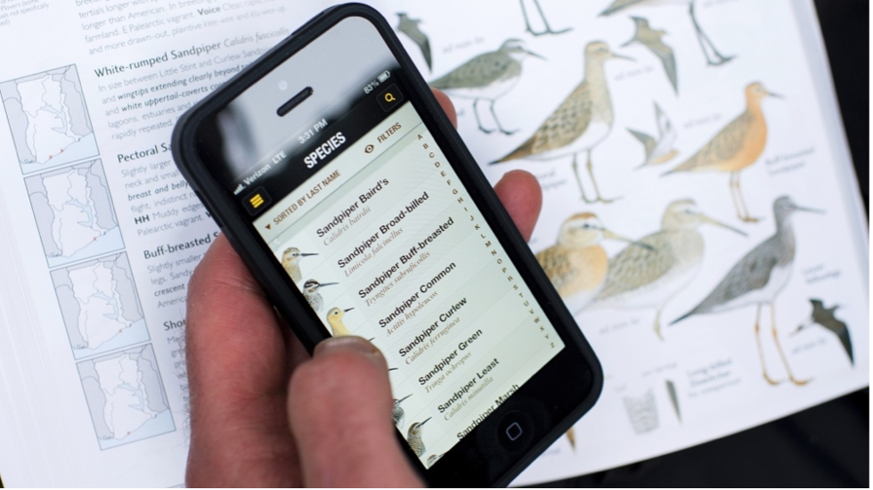
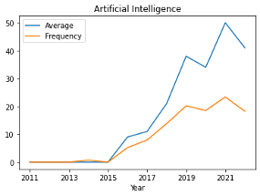

---

layout: default
title: Digital Conservation Practices and Perspectives - Summary of Findings

---

| \ [Source](https://blog.nature.org/2013/05/27/boucher-bird-blog-apps-smart-birder/)| Big data and related data collection tools such as acoustic sensors; machine learning and artificial intelligence (AI) algorithms; dashboards and platforms for sharing data – these all constitute “digital conservation.” Digital technologies have the potential to make conservation more holistic, responsive, and participatory. Already, platforms such as eBird enlist the public in monitoring projects and there is an effort to “democratize” AI tools so that more conservation organizations can use them. Digital technologies may also provide precise data and, as a result, the ability to prioritize conserving the places that will most effectively meet nature protection goals like the Kunming-Montréal Global Biodiversity Framework’s 30% by 2030 target. |

| We hear a lot about the promises of digital conservation and less about the challenges. Is access to digital conservation democratic? Are outcomes lining up with expectations? In general, what do conservationists actually think about and do with digital tools? | \ [Source](https://cnr.ncsu.edu/news/2022/01/transforming-data-into-conservation/)|

| \ [Source](https://commons.wikimedia.org/wiki/File:Online_Survey_Icon_or_logo.svg)| We conducted three surveys to understand practices and perspectives on digital conservation: 1) We counted and correlated keywords on conservation technology-related websites and the websites of 69 conservation organizations; 2) We conducted a more traditional survey of 45 organizations across Canada and the US on their use of conservation technologies, their goals in using them, and the outcomes they’ve seen; 3) We ran what’s known as a Q-method survey with 10 individuals in the sector to characterize distinct ways of thinking about digital conservation. Additionally, we explored a case study digital conservation project, interviewing five key informants and reviewing primary materials.|

| The average number of times many different digital technologies are mentioned on conservation-related websites has increased since 2011. The share of pages they’re discussed on has grown as well. Together, this suggests that not only are conservation technologies cropping up more frequently, they’re being discussed at-length and not just mentioned in passing.\ The conversation on digital conservation revolves around some technologies (e.g. camera traps), domains (e.g. forests), practical and ethical concerns (e.g. costs, privacy), and conservation approaches (e.g. partnerships) and not others.\ For instance, machine learning and AI are increasingly discussed across the conservation community. However, these remain relatively rare on most organizations’ own websites. Typically, only larger organizations mention these kinds of tools.\ Discussions around AI involve cost (44% of the time) more than surveillance (only 10% of the time). But these issues are rarely mentioned alongside other aspects of digital conservation, such as citizen science. This suggest that some technologies, such as AI, may be thought about in terms of practical and ethical considerations more than others are. | \ \Note: “Average” refers to all mentions of the term, divided by the number of websites examined, and multiplied by 100. “Frequency” refers to the percentage of all websites examined that the term is mentioned on.|

| | Big data is one of the most common technologies conservation organizations report using. We surveyed local, regional, and international conservation organizations based in the US and Canada. Participation skewed towards local and regional organizations. Half – 22 out of 45 – reported using big data: data collected from sensors, drones, traps, or citizen science projects in relatively large quantities, at a rapid rate, and/or in a variety of formats. Only six reported using AI.

Drawing on in-house capacity to utilize digital tools can be demanding in terms of expertise and time. Outsourcing might cost money. We found that organizations’ uses of big data and AI are mostly done by partners, though many also rely on in-house capacity. This suggests that access to digital conservation may be democratic inasmuch as less capable organizations can partner with groups that have the resources to utilize such tools.|
| | Real-time monitoring was the most common goal organizations reported using big data for. They want to be able to rapidly produce information on species and ecosystems. More precise data and a wider range of it were also common goals.

These weren’t just goals though – they were strongly seen as outcomes. For instance, all but a handful of organizations who named real-time monitoring as a goal agreed or strongly agreed that the goal was being met. |
| | Cost and capacity were seen as the biggest challenges that using big data presents, with surveillance not seen as an issue. Privacy concerns – such as the sensitivity of rare species data – were considered important by some respondents but not others.        |
| | Organizations using AI are interested in speeding up analysis, though accuracy and minimizing labour time and costs are also important.

The few organizations that reported using AI do not seem satisfied with it. For instance, only one strongly agreed that any of their goals were actually achieved (saving labour time and costs).

The main challenges seen in applying AI to conservation are being able to explain how the AI analysis works, the time it takes to use, as well as technical capacity.

There was significant interest in AI from many organizations not currently using it. Some organizations hope to use AI to minimize labour costs. However, as noted above, this was not frequently reported as an outcome by the organizations currently using it for this end|
| | Web platforms and portals promise the possibility of two-way interactions between conservation organizations and the public. However, we found that while disseminating information through platforms and portals was an important goal for conservation organizations, the more involved task of collecting input from the public was not. |
| Everyone agrees that AI hasn’t yet revolutionized conservation. 

However, one distinct perspective on digital conservation questions its promises to bring about efficiency and empowerment and instead highlights the ethical issues of technologies such as drones and AI. 

Two other perspectives are more optimistic - one emphasizes tools’ efficiency, responsiveness, and labour-saving promises while another focuses on their societal and organizational outcomes, including how they might democratize conservation, facilitate knowledge transfer and shape public perceptions of nature. | \ Note: “Statement” refers to each specific statement about digital conservation’s promises and challenges we ask participants to rank according to how strongly they agreed or disagreed with it. There are three colours of dots, each referring to a distinct perspective on digital conservation, defined by participants with similar sorts. “Z_Score” refers to the level of agreement or disagreement with the statement for each perspective. Statements are sorted such that at the top are statements the different perspectives had the least consensus about; statements at the bottom are those each perspective agrees with each other on.     |
| \ The Bird Returns project in California utilizes data from a variety of sources, including the eBird app, to inform a partnership with farmers to protect migratory waterbird habitat.\[Source](http://www.calricenews.org/wp-content/uploads/2017/06/BR-Workshop-Presentation-June20171.pdf) | While big data and AI techniques may help “resource-constrained” conservation organizations achieve their missions “more cheaply and efficiently”, data for conservation applications often requires not only the right kind of expertise, but expensive storage and analytical infrastructures that have to be trusted and maintained for potentially indefinite periods. Digital technology might provide the infrastructure to scale conservation, but it actually requires infrastructuring itself. When conservationists turn to tech, they might find themselves working through new old problems, like how to manage biases in data from people, how to deal with model errors, and so on.        |
| TAKEAWAYS\ \[Source](https://www.iis-rio.org/en/projects/naturemap-priority-areas-for-conservation-and-restoration-of-natural-systems/) | There are a variety of perspectives on digital conservation – it’s not just hype, and even the optimism comes in distinct flavours.\ There is some cause for concern inasmuch as there is interest in using AI for goals that may not be achievable, at least as reported by those currently using it.\ Cost is certainly a barrier to accessing digital conservation, but partnerships may be one way around this. |
| We invite all stakeholders to continue the conversations that are happening around the ethical dimensions of digital conservation.\ We invite funders to consider scaling back requirements for data-intensive metrics – these are at once a driver of digitalization, but also a potential hindrance because of the infrastructure they require.\ We call on universities to develop training – at both a practical and ethical level – in conservation technologies. | NEXT STEPS\ \[Source](https://www.conservation.org/blog/in-blockchain-technology-a-futuristic-solution-to-conservations-greatest-challenges)  |

