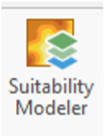
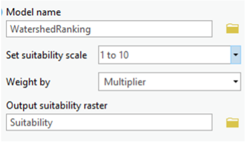
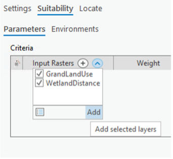
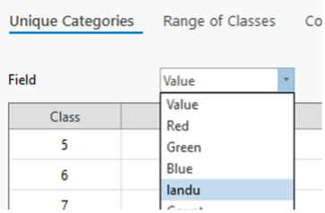
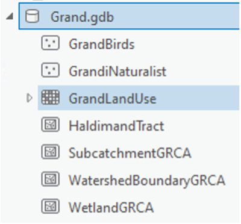
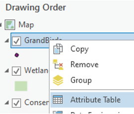
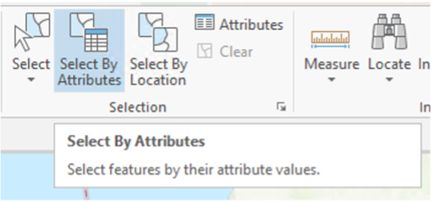
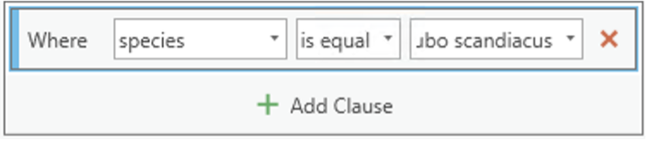
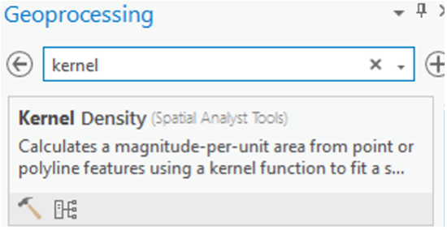
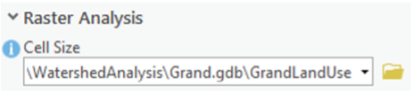

---

layout: default
title: Digital Conservation - Watershed Prioritization Using New Data Sources Lab

---
We are not trying to train you to be Geographic Information System (GIS) technicians. You will learn how to employ GIS and modeling, social media/volunteered geographic information, and data dashboards in specific use cases – modeling landscapes, assessing recreational and other ecosystem services, and interactively prioritizing conservation investments. 

The lab is divided into three parts:
1.	Modeling Landscape Values
2.	Social Media and Volunteered Geographic Information
3.	Dashboards for Prioritizing Conservation Investments

By the end, you'll have created a data dashboard, the kind of which we see many conservation organizations deploying for public outreach and decision-making purposes right now. Specifically, you’ll have built a dashboard that would help decision-makers prioritize conservation investments in a southern Ontario watershed.

The overarching prompt that will guide your work: where should we invest in new conservation areas? Imagine you are tasking a GIS tech with building a publicly-available tool that would allow you, your organization, and your partners to investigate watershed conditions and possible areas for investment. It would be helpful to know, in some detail, what to task the tech with building. Through this you will learn about the kinds of conservation tools, tech, and data available to organizations and some of the practical and ethical concerns arising in them.

### Requirements
To complete this lab, you will need the following:
* Access to an ArcGIS account from Esri
* Access to ArcGIS Pro software
* Access to one of the lab datasets - available here [(Niagara Region)]() and here [(Toronto Region)]

## Part 1 – Modeling Landscape Values

We will be using the industry-standard ArcGIS Pro to get high-level experience working with classic and emerging conservation tools and technology. The goal is not to have you memorize which buttons to push, but to think through practical and ethical concerns that arise when implementing these within an organizational mission.

1.	**Access one of the lab datasets** using the links above

2.	**Unzip the file** you just downloaded. You can do this by right-clicking and “Extract Here” with 7-Zip on a Windows computer or any other similar utility.

3.  **Open the folder** you just unzipped and double click on the ArcGIS Project File. The following image illustrates this for the Niagara Region example:\
{: width="75%" height="75%" }

4. **Review the spatial data layers** in front of you. We have the watershed boundaries, land use categories derived from satellite imagery, as well as mapped wetland locations and existing conservation spaces.

5. We are going to **create a model** to determine the suitability of areas in the watershed for investment in conservation actions (restoration, protection, etc.). Our model will be based on two criteria:
* distance to wetlands or greenspace
* land use type

6. First, we will **calculate distances** from all spots on the map to either wetlands or existing greenspaces. 
* **Click on the Analysis tab and then Toolbox.** 
* Search for **Euclidean Distance** and open the tool:\
{: width="75%" height="75%" }
* Your input is either the wetlands or greenspaces layer:\
{: width="75%" height="75%" }
* **Click on the Environments tab and set the Raster Analysis variables** Cell Size, Mask, and Clip Raster to be the same as the land use layer:\
{: width="75%" height="75%" }
* Click **run**!

7. Now we need to evaluate and classify our data – is more distance from an existing wetland or greenspace a good thing or a bad thing? Areas closer to wetlands or existing parks might be more highly ranked – or not, depending on the context. Likewise, areas with certain land use types (e.g. for BMPs, agricultural uses) would be ranked more or less highly depending on the context.
* **In the Analysis toolbar, choose Suitability Modeler:**\
{: width="25%" height="25%" }
* In the pane that appears on the right, **give your model a good name**, like Conservation Suitability or WatershedRanking. Choose whether you want a 1-5 or 1-10 (or some other) scale to rank areas’ suitability for conservation:\
{: width="75%" height="75%" }
* **Click the Parameters tab**, then the dropdown arrow, and select the land use and distance layers:\
{: width="75%" height="75%" }
* **Click on the circle to the left of each layer in the Criteria pane**. When you click on the circle for land use, **choose unique ranks and the `landu` variable** from the dropdown menu that appears. Choose what you think the right suitability is for the different land use types. By default, suitability is ranked on a 1 (worst) to 10 (best) scale:\
{: width="75%" height="75%" }
* When you click on the circle next to the distance layer, you can **stick with “continuous functions”**. 
* For now, your model will have two criteria:
    a. distance to wetlands or greenspace
    b. and use type
You can weight them however you like, it all depends on exactly what you’re envisioning as the specific conservation decision here. 

## Part 2 – Social Media and Volunteered Geographic Information

Publicly available social media data, especially data with a spatial component (volunteered geographic information - VGI) can prove to be a very valuable, if also very limited, source of data for conservation efforts. It can tell us about stakeholder preferences and values, it can give us more precise information, and it amounts to massive numbers of species observations. 

In this part of the lab, we’ll try to make use of VGI species observations reported to eBird and/or iNaturalist. Specifically, we’ll enrich our watershed conservation suitability model by adding these observations as proxies for species presence in an area and/or its recreational value. The eBird data I’ve provided includes over 300,000 observations made in Ontario of vulnerable, endangered, critically endangered, and even extinct species (?!) The metadata for it is available [here](https://www.gbif.org/occurrence/download/0256061-210914110416597). The iNaturalist data includes about 17,000 observations made in southern Ontario of threatened native plant species. 

1.  **Load either the eBird or iNaturalist data** I have assembled for you. Open the Catalog pane, turn the arrow on the database, and drag the layer on to the map.\
{: width="75%" height="75%" }

2.  **Optional but recommended**: You can filter the eBird or iNaturalist data depending on what exactly you might be interested in…For instance, if you only wanted to include a single species in your model of how suitable areas are for conservation, you could filter the data to only observations of that species. Or you could filter it to only high quality observations. Or only observations made recently.\ 
**Right click on the layer in the Contents pane and select Attribute Table**. To filter, choose the Select by Attributes tool in the top toolbar and Create a New Expression. In the example at the right, I’ve filtered the eBird data to only observations of Bubo scandiacus (snowy owl).\
{: width="75%" height="75%" }\
{: width="75%" height="75%" }\
{: width="75%" height="75%" }

3.  This time around we’re not going to calculate the distance from each area to each species observation (though that could certainly make sense). **Instead, we’ll calculate the density of observations**, in order to give us a sense of how common it is to observe the species, or to have people recreating, in an area. Calculating density like this is a good way to get around the fact that eBird, iNaturalist, and other such data sources are only samples of all species observations / nature recreation activities that exist in a given area.
* **Find the Kernel Density tool** by opening the Toolbox through the Analysis tab. 
{: width="75%" height="75%" }\
* **Enter the eBird or iNaturalist layer as your input**. In the Parameters pane, simply set the Cell Size environment to the land use layer.
{: width="75%" height="75%" }\
* Click **run**!

4.  **Add the new layer** to your suitability model following the same steps that you took in Part 1 to add the land use and distance to wetlands/parks layers. Don’t forget to click on the circle to the left of the density layer you add to the model and to classify it. 

