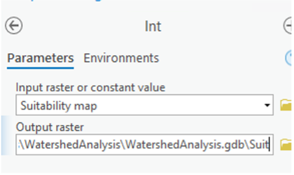
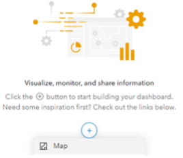

---

layout: default
title: Digital Conservation - Watershed Prioritization Using New Data Sources Lab

---
We are not trying to train you to be Geographic Information System (GIS) technicians. You will learn how to employ GIS and modeling, social media/volunteered geographic information, and data dashboards in specific use cases – modeling landscapes, assessing recreational and other ecosystem services, and interactively prioritizing conservation investments. 

The lab is divided into three parts:
1.	Modeling Landscape Values
2.	Social Media and Volunteered Geographic Information
3.	Dashboards for Prioritizing Conservation Investments

By the end, you'll have created a data dashboard, the kind of which we see many conservation organizations deploying for public outreach and decision-making purposes right now. Specifically, you’ll have built a dashboard that would help decision-makers prioritize conservation investments in a southern Ontario watershed.

The overarching prompt that will guide your work: where should we invest in new conservation areas? Imagine you are tasking a GIS tech with building a publicly-available tool that would allow you, your organization, and your partners to investigate watershed conditions and possible areas for investment. It would be helpful to know, in some detail, what to task the tech with building. Through this you will learn about the kinds of conservation tools, tech, and data available to organizations and some of the practical and ethical concerns arising in them.

### Requirements
To complete this lab, you will need the following:
* Access to an ArcGIS account from Esri
* Access to ArcGIS Pro software
* Access to one of the lab datasets - available here [(Niagara Region)]() and here [(Toronto Region)]

## Part 1 – Modeling Landscape Values

We will be using the industry-standard ArcGIS Pro to get high-level experience working with classic and emerging conservation tools and technology. The goal is not to have you memorize which buttons to push, but to think through practical and ethical concerns that arise when implementing these within an organizational mission.

1.	**Access one of the lab datasets** using the links above

2.	**Unzip the file** you just downloaded. You can do this by right-clicking and “Extract Here” with 7-Zip on a Windows computer or any other similar utility.

3.  **Open the folder** you just unzipped and double click on the ArcGIS Project File. The following image illustrates this for the Niagara Region example:\
{: width="75%" height="75%" }

4. **Review the spatial data layers** in front of you. We have the watershed boundaries, land use categories derived from satellite imagery, as well as mapped wetland locations and existing conservation spaces.

5. We are going to **create a model** to determine the suitability of areas in the watershed for investment in conservation actions (restoration, protection, etc.). Our model will be based on two criteria:
* distance to wetlands or greenspace
* land use type

6. First, we will **calculate distances** from all spots on the map to either wetlands or existing greenspaces. 
* **Click on the Analysis tab and then Toolbox.** 
* Search for **Euclidean Distance** and open the tool:\
{: width="75%" height="75%" }
* Your input is either the wetlands or greenspaces layer:\
{: width="75%" height="75%" }
* **Click on the Environments tab and set the Raster Analysis variables** Cell Size, Mask, and Clip Raster to be the same as the land use layer:\
{: width="75%" height="75%" }
* Click **run**!

7. Now we need to evaluate and classify our data – is more distance from an existing wetland or greenspace a good thing or a bad thing? Areas closer to wetlands or existing parks might be more highly ranked – or not, depending on the context. Likewise, areas with certain land use types (e.g. for BMPs, agricultural uses) would be ranked more or less highly depending on the context.
* **In the Analysis toolbar, choose Suitability Modeler:**\
{: width="25%" height="25%" }
* In the pane that appears on the right, **give your model a good name**, like Conservation Suitability or WatershedRanking. Choose whether you want a 1-5 or 1-10 (or some other) scale to rank areas’ suitability for conservation:\
{: width="75%" height="75%" }
* **Click the Parameters tab**, then the dropdown arrow, and select the land use and distance layers:\
{: width="75%" height="75%" }
* **Click on the circle to the left of each layer in the Criteria pane**. When you click on the circle for land use, **choose unique ranks and the `landu` variable** from the dropdown menu that appears. Choose what you think the right suitability is for the different land use types. By default, suitability is ranked on a 1 (worst) to 10 (best) scale:\
{: width="75%" height="75%" }
* When you click on the circle next to the distance layer, you can **stick with “continuous functions”**. 
* For now, your model will have two criteria:
    a. distance to wetlands or greenspace
    b. and use type
You can weight them however you like, it all depends on exactly what you’re envisioning as the specific conservation decision here. 

## Part 2 – Social Media and Volunteered Geographic Information

Publicly available social media data, especially data with a spatial component (volunteered geographic information - VGI) can prove to be a very valuable, if also very limited, source of data for conservation efforts. It can tell us about stakeholder preferences and values, it can give us more precise information, and it amounts to massive numbers of species observations. 

In this part of the lab, we’ll try to make use of VGI species observations reported to eBird and/or iNaturalist. Specifically, we’ll enrich our watershed conservation suitability model by adding these observations as proxies for species presence in an area and/or its recreational value. The eBird data I’ve provided includes over 300,000 observations made in Ontario of vulnerable, endangered, critically endangered, and even extinct species (?!) The metadata for it is available [here](https://www.gbif.org/occurrence/download/0256061-210914110416597). The iNaturalist data includes about 17,000 observations made in southern Ontario of threatened native plant species. 

1.  **Load either the eBird or iNaturalist data** I have assembled for you. Open the Catalog pane, turn the arrow on the database, and drag the layer on to the map.\
{: width="50%" height="50%" }

2.  **Optional but recommended**: You can filter the eBird or iNaturalist data depending on what exactly you might be interested in…For instance, if you only wanted to include a single species in your model of how suitable areas are for conservation, you could filter the data to only observations of that species. Or you could filter it to only high quality observations. Or only observations made recently.\ 
**Right click on the layer in the Contents pane and select Attribute Table**. To filter, choose the Select by Attributes tool in the top toolbar and Create a New Expression. In the example at the right, I’ve filtered the eBird data to only observations of Bubo scandiacus (snowy owl).\
{: width="50%" height="50%" }\
{: width="75%" height="75%" }\
{: width="75%" height="75%" }

3.  This time around we’re not going to calculate the distance from each area to each species observation (though that could certainly make sense). **Instead, we’ll calculate the density of observations**, in order to give us a sense of how common it is to observe the species, or to have people recreating, in an area. Calculating density like this is a good way to get around the fact that eBird, iNaturalist, and other such data sources are only samples of all species observations / nature recreation activities that exist in a given area.
* **Find the Kernel Density tool** by opening the Toolbox through the Analysis tab.\
{: width="75%" height="75%" }
* **Enter the eBird or iNaturalist layer as your input**. In the Parameters pane, simply set the Cell Size environment to the land use layer.\
{: width="75%" height="75%" }
* Click **run**!

4.  **Add the new layer** to your suitability model following the same steps that you took in Part 1 to add the land use and distance to wetlands/parks layers. Don’t forget to click on the circle to the left of the density layer you add to the model and to classify it. 

## Part 3 – Dashboards for Prioritizing Conservation Investments

Data dashboards have existed in one form or another for a long time. Modeled on car dashboards and premised on the idea of a decision-maker behind the wheel using the information to guide their choices, today dashboards are more visible in the public eye as well as more accessible to the public. In the early part of the pandemic, Johns Hopkins’s COVID-19 dashboard became an important, almost canonical source of the pandemic’s patterns and trends for many people; later, state, provincial, and local-level entities would create their own to share their data. More organizations and individuals can create a dashboard than ever before in just a few steps and share it with the world. 

Data dashboards are, of course, not just for tracking pandemics, but for sharing insights on illegal fishing (Global Fishing Watch), forest loss (Global Forest Watch), sea level rise (CoastalResilience.org) and prioritization. Our goal is to upload our suitability model as a dashboard so that users – others in your organization, your partners, and/or the public – can evaluate the model for themselves and start a discussion about which places it shows as more or less suitable.

1.  We’re going to **get our map ready to publish and share**. This will require a few nitpicky steps. Remember, the goal is not to memorize these, but to get a sense of the practical and technical work involved, as well as the conceptual and ethical implications of the choices you make along the way.
* First, we need to **convert the suitability map** to a different raster format.
* **Search for the “Int” tool** in the Geoprocessing menu (the Toolbox).
* **Open the Int tool** and use the Suitability map layer as your input.\
{: width="75%" height="75%" }

2.  Next, we need to convert the raster file to a different kind of spatial data entirely – a polygon layer. What we’re doing is going from a grid of cells (areas) to polygons of different shapes.
* **Search for and open the Raster to Polygon tool**. Enter the raster you just created using the Int tool as the input. Choose “Value” as the field if it isn’t already selected. Be sure to select “simplify polygons” and “create multipart features” – these options help make the output manageable.\
{: width="75%" height="75%" }

3.  **Optional**: The result of turning our data into polygons is that our map probably looks a bit “messier” and a lot harder to compare consistently across it. The shapes might reflect ecological realities on the ground, but they might also provide us too much detail at this stage. One thing we can do to correct this is to aggregate the data. We can “bin” it into grids like we saw on Global Fishing Watch’s platform. To do this, we first need to **create a grid**.
* **Search for and open the Generate Tessellation tool**. I recommend creating a grid with square shapes, though the choice is yours. You can make them as large or small as you like, though I’ve found 5 sq. km. to be a reasonable choice.\
{: width="75%" height="75%" }
* **Run** the tool! 
* The result of running “Generate Tessellation” is a blank grid on our map. Now we need to join our suitability data to it.
* We do this with a “Spatial Join”. **Right click on the grid you just produced, navigate to “Joins and Relates” and choose Spatial Join**. The Join Features should be the polygon version of the suitability map, which you generated in step 3 above.\
{: width="75%" height="75%" } 
* **Expand the Fields pane and navigate to “gridcode”**. You need to tell ArcGIS how it should summarize the suitability values in each part of the grid. Let’s say there are 10 areas you’ve modeled that fall within one grid cell. Should the software take the average suitability value of each area and assign that to the grid cell? Should it take the median? Some other statistic? In the example above, I’ve instructed ArcGIS to take the median, but other measures may be valid.
* **Click ok!**

4.  At this point, you should have the final version of your map – at least in terms of what you need to calculate. But it may not look “good.” **We can “symbolize” it properly**.
* Right click on the final suitability map that you produced in step 3 above (or, optionally, step 4) and **choose Symbology**. 
* Under Primary symbology, **choose Graduated Colors. For field, select gridcode**.\
{: width="75%" height="75%" }
* The other options, including the color scheme, are entirely up to you. You may wish to use different statistical techniques for showing the results (e.g. equal ranges or quartiles) or more or fewer classes (by default, it will classify the results into 5 classes).

5.  There are many styling options that are available to you. Once you have finalized the style of your map, it’s time to publish it!
* First, **unselect all layers** from the Contents pane, except the layer you just finished styling.\
{: width="25%" height="25%" } 
* Next, **select Web Map** from the Share tab on the toolbar.\
{: width="75%" height="75%" }
* **Give your map a decent name**, provide a quick summary, and add some tags.
* **Click Run!** It may take some time to finish running, but what it’s doing is loading your map to ArcGIS Online.

6.  As ArcGIS is publishing your map, you can open up a browser like Chrome and **navigate to your ArcGIS online account**. Log in using your Esri account. 
 
7.  Once logged in, **navigate to Content and under the Create app button, choose Dashboard**.\
{: width="75%" height="75%" }

8. The first thing you want to do with your dashboard is to add a map. **Click the + sign and choose map**.\
{: width="75%" height="75%" }

9. You should see the map you uploaded from ArcGIS Pro in the menu that appears. **Select it**.\
{: width="75%" height="75%" }

10. **Summarize**. Your map looks good, but it’d be helpful to have some summary information alongside it, like how much of the watershed has been classified as one suitability vs. another. We can estimate this visually, but it’d be nice to have the numbers in order to advance our decision-making.
* **Add a pie chart** to your map by clicking on the + sign and choosing Pie Chart.\
{: width="75%" height="75%" }  
* In the Data options menu for your Pie Chart, **filter any null values** (see example in the screenshot below.
* **Link the pie chart to your map**. This will allow users to select part of the pie chart (e.g. Suitability = 14) and see only those areas in the watershed that have that suitability level. By choosing “Multiple” in the Selection mode you can allow users to pick more than one suitability (e.g. where are the areas that have Suitability = 1 or Suitability = 15.)\
{: width="75%" height="75%" }\
{: width="75%" height="75%" }

11. You can continue to **refine your dashboard** as much as you like. For instance, the colors in your pie chart probably won’t match the colors are your map. There’s no easy way to fix that, unfortunately. Again, remember that our goal here is to make a polished product – it’s to go through the steps.

12. **Save your dashboard!!!**\
{: width="50%" height="50%" }  

13. Last but not least, **share your dashboard!!!**  Back in the Content tab of ArcGIS Online, find your dashboard and choose “View Dashboard” that should take you to the publicly-available version of it.\
{: width="75%" height="75%" }  

## Reflections
* Many conservation groups, such as the Conservation Authorities, have GIS expertise on staff. Reflect on what kind of expertise, time, money, and so on it would take or has taken to integrate this kind of workflow and analysis into your organization.
* Would this sort of analysis be of value to your own organization’s decision-making? To your public engagement efforts? If not, what would you need to run this for an area of interest to you and/or your organization? Is that information available?
* The outputs are more or less granular. Do we need to summarize the information in some other form? By city, county, watershed, or something else?
* Part of the point of data dashboards are to give non-expert decision-makers a fuller view on the data. But the allure of data accessibility can also mean forgetting to ask where the data is coming from and how it was produced. How explainable do you think the results of this analysis are?
* What sort of trust do you have in this data?
* What assumptions did you have to make (e.g. about distances to wetlands or parks, about the meaning or accuracy of eBird or iNaturalist data, etc.) and how would changing these assumptions affect the results?
* What sorts of ethical concerns can you identify in this analysis, perhaps around our use of VGI (volunteered geographic information)?
* What more would we have to do to make the eBird and/or iNaturalist data relevant to conservation prioritization purposes? 